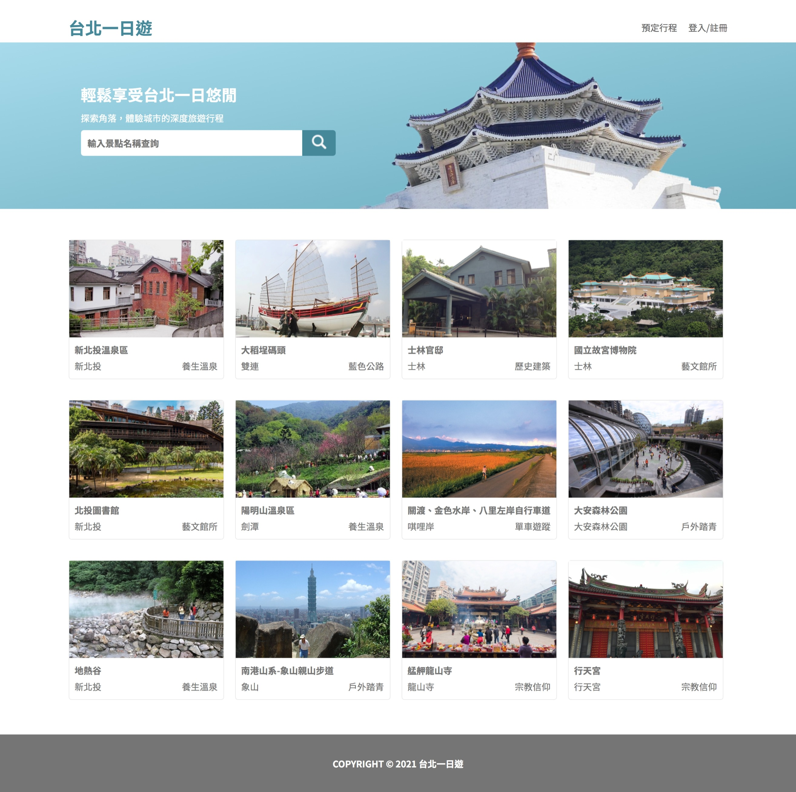
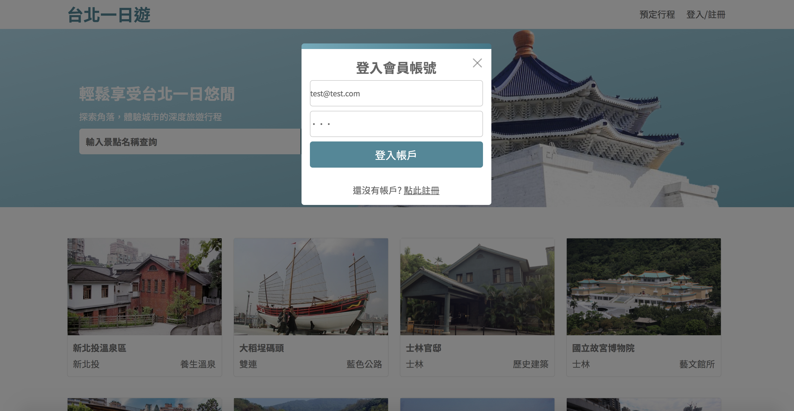
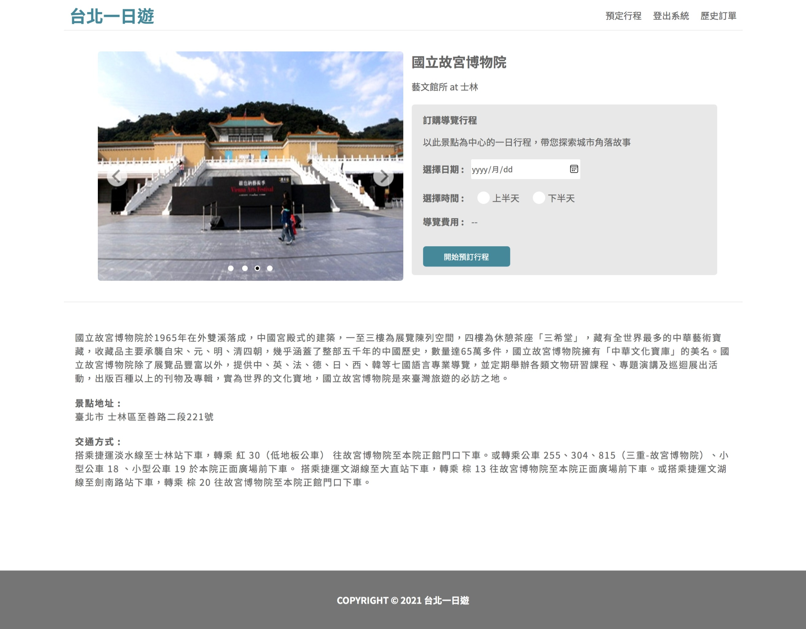
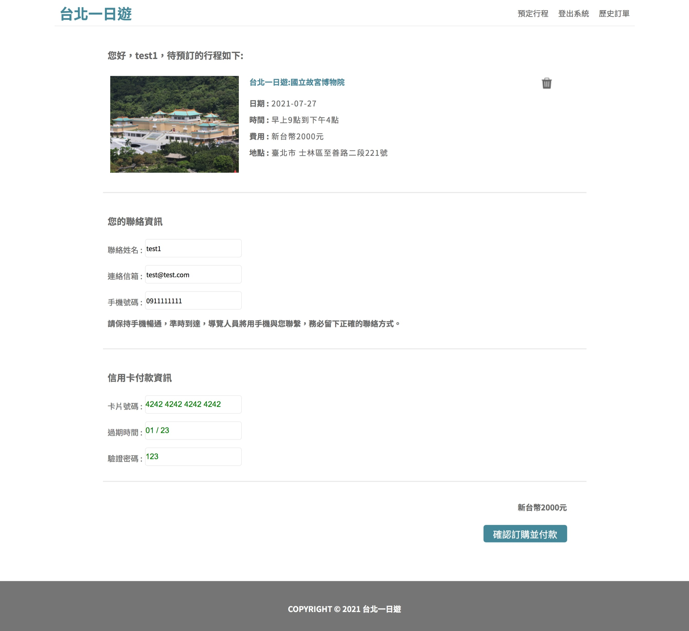
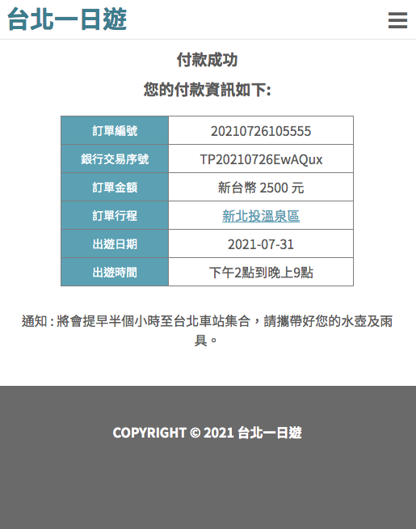
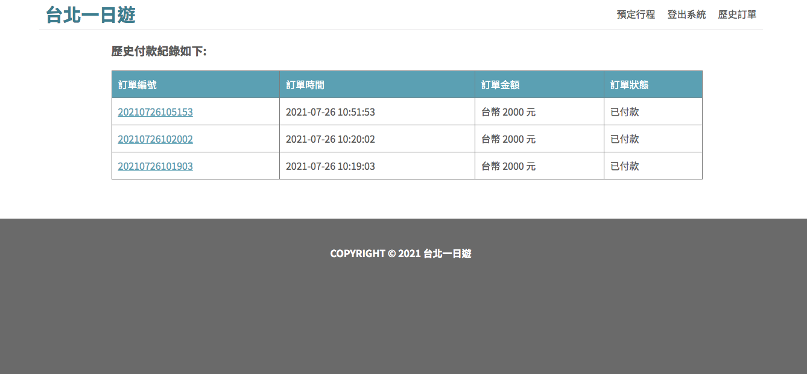
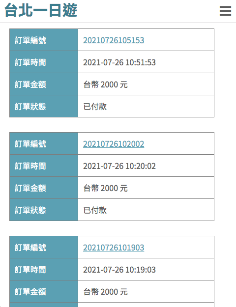

# 台北一日遊網站

## 網站功能
* 查看、搜尋台北景點
* 個別景點介紹頁面
* 加入會員 可線上預定導覽行程
* 串接Tappay金流付款，線上付款完成行程預定
* 歷史訂單查看

## 使用技術
- 使用AWS EC2雲端架站、資料庫使用MySQL
- 前端 HTML, CSS, JS
- 後端 Python - Flask Framework
- 部署nginx反向代理、Docker 
- Tappay金流串接
- SSL憑證實踐HTTPS
- RESTful API 設計架構
- MVC 設計模式

## Demo
web: https://taipeitrip.site

測試帳號：test@test.com (或自行註冊)

密碼：123

Credit Card: 4242 4242 4242 4242

Date: 01/23

CCV: 123

## 頁面預覽
### 1.首頁

#### 首頁RWD:

### 2.登入頁面

### 3.景點介紹頁面

#### 景點頁面RWD:

### 4.預定行程頁面

#### 預定行程頁面RWD:

### 5.付款完成頁面

#### 付款完成RWD:

### 6.歷史訂單紀錄頁面

#### 歷史訂單頁面RWD:
